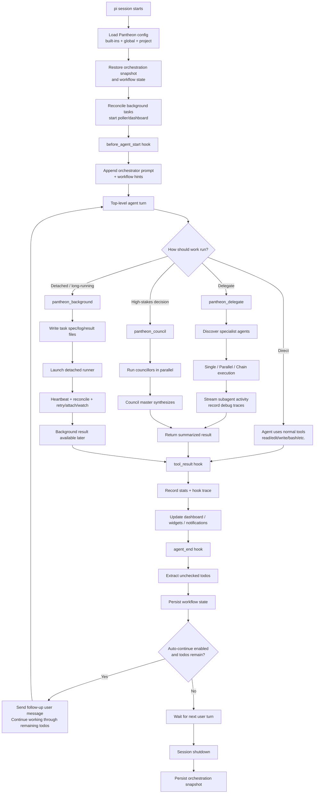

# Pantheon Orchestration Diagram

This note explains how the automated orchestration system in `oh-my-opencode-pi` works at a high level.

## End-to-end flow

## Main runtime pieces

- `extensions/oh-my-opencode-pi/index.ts` — composition root for hooks, tools, commands, dashboard, and routing
- `extensions/oh-my-opencode-pi/config.ts` — config loading, merge order, and sanitization
- `extensions/oh-my-opencode-pi/orchestration.ts` — hook-event snapshot and trace model
- `extensions/oh-my-opencode-pi/workflow.ts` — todo extraction, persistence, resume context, workflow hints
- `extensions/oh-my-opencode-pi/background.ts` — detached task lifecycle, heartbeats, retry, stale detection, tmux attach
- `extensions/oh-my-opencode-pi/agents.ts` — specialist discovery and prompt/model overrides
- `agents/orchestrator.md` — top-level orchestration guidance appended to the main agent

## Mental model

- **Hooks** shape the top-level session behavior.
- **Prompt injection** teaches the main agent how to route work.
- **Delegation** runs one or more specialists in isolated contexts.
- **Council** provides multi-model consensus.
- **Background tasks** detach long-running work from the foreground turn.
- **Workflow state** preserves unchecked todos and recent task context.
- **Observability** comes from stats, debug traces, and orchestration snapshots.
